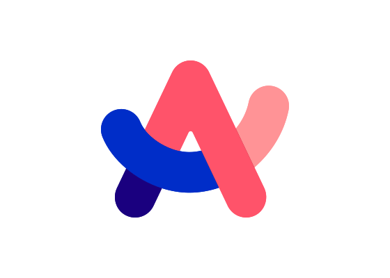
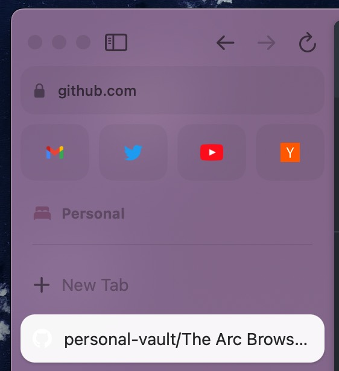
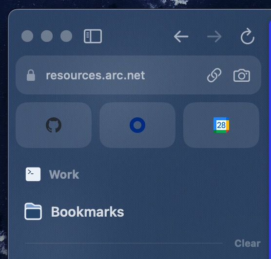

I have (and a lot of the team at FATMAP) have been getting really into this new browser called Arc. It is pretty much a new way of browsing the internet with this super cool mixture of art and engineering. There are some elegant ways of navigating - mainly the "spotlight" method of not needing to remove your hands from the keyboard to get around. 

Granted, this was possible before but Arc just makes it a bit more exciting and fun to do. 

I have decided that I will keep this document in my vault so that I can write down things I learn (through stupidity or otherwise) as well as my opinions on the browser itself.

## Nifty Things I Learned
### Profiles and Spaces
Hands down the best thing about this browser is the context switching. I can have a `Personal` space as well as we `Strava` space and a `FATMAP` space. The spaces allow me to stay organized with what I have open where (if you are disciplined enough).  They look like this:

However, I think the cooler thing here is the ability to use "Profiles". Profiles is true context control. It is like have two **totally separate** browsers next to each other. So, in my `Personal` profile, I can have things like my personal Youtube and Hacker News logged in but if I switch to my `Work` space which is using a `Work` profile, non of that is logged in. So if I happen to go to Youtube in my work space, I won't be logged in to my personal one. 

It is an elegant solution for keeping track of my internet presences and keeping them locked down. Another example I might create (just thinking of it) is a spam profile. This is where I am just logged into things like Proton mail, Youtube, etc with accounts I do not care about - burn accounts essentially.